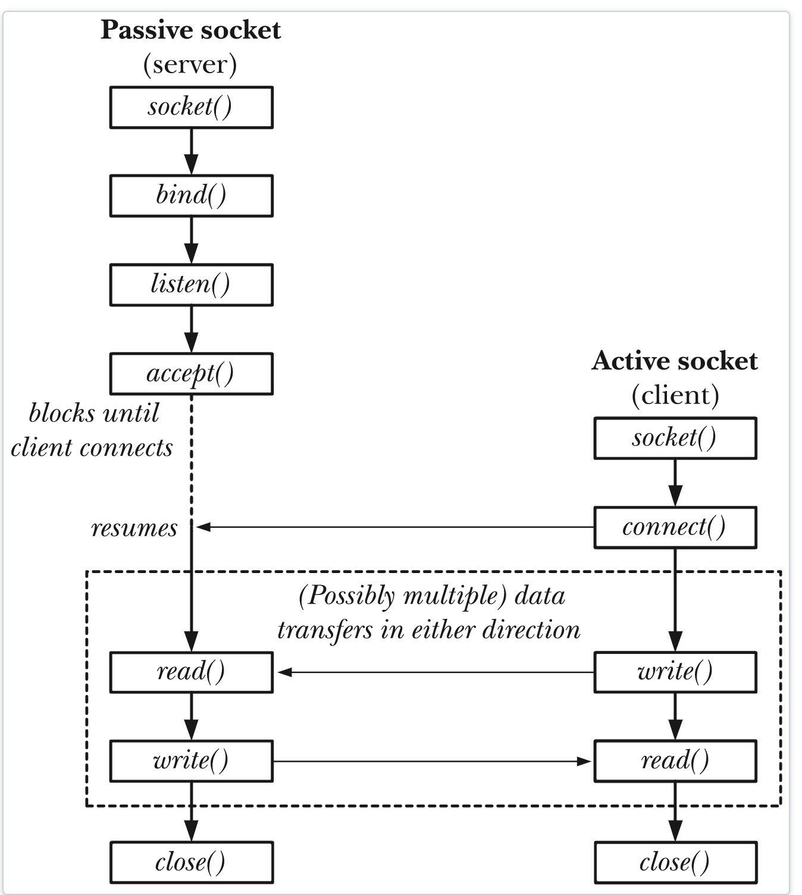

# Linux下Socket编程及IO多路复用

<!--more-->

从快毕业到参与工作半年了，从在校的时候编写一些单机版的PC端软件，到现在进入公司接触分布式系统，进入OLAP的领域，感觉自己也成长了不少。如今由于疫情的影响，在家宅了也快一个月，工作之余也应该把博客捡起来，也算是对自己成长的一个见证吧。

由于笔者在校期间主要做的是Windows下单机的PC端软件的开发，因此这篇博客就从Linux下的Socker编程开始，作为一个转变的分界点开篇。

和Java的万物皆对象类似，Linux下的一切都是文件，在Linux下是通过Socket进行网络编程的，Socket也是文件描述符的一种，服务端通过打开一个Socket，等待客户端连接后会返回一个新的文件描述符 `fd`，通过对该文件描述符的读写完成Server端和Client端的通信。



### Socket编程API

```
1、socket函数
    syntax:int socket(int domain, int type, int protocol);
功能说明：
   调用成功，返回socket文件描述符；失败，返回－1，并设置errno
参数说明：
　　domain指明所使用的协议族，通常为PF_INET，表示TCP/IP协议；
　　type参数指定socket的类型，基本上有三种：数据流套接字、数据报套接字、原始套接字
　　protocol通常赋值"0"。
　　两个网络程序之间的一个网络连接包括五种信息：通信协议、本地协议地址、本地主机端口、远端主机地址和远端协议端口。socket数据结构中包含这五种信息。

2、bind函数
    syntax:int bind(int sock_fd,struct sockaddr_in *my_addr, int addrlen);
功能说明：
   将套接字和指定的端口相连。成功返回0，否则，返回－1，并置errno.
参数说明：
    sock_fd是调用socket函数返回值,
    my_addr是一个指向包含有本机IP地址及端口号等信息的sockaddr类型的指针；
    struct sockaddr_in结构类型是用来保存socket信息的：
    struct sockaddr_in {
        short int sin_family;
        unsigned short int sin_port;
        struct in_addr sin_addr;
        unsigned char sin_zero[8];
    };
    addrlen为sockaddr的长度。

3、connect函数
    syntax: int connect(int sock_fd, struct sockaddr *serv_addr,int addrlen);
功能说明：
   客户端发送服务请求。成功返回0，否则返回－1，并置errno。
参数说明：
   sock_fd 是socket函数返回的socket描述符；serv_addr是包含远端主机IP地址和端口号的指针；addrlen是结构sockaddr_in的长度。

4、listen函数
    syntax:int listen(int sock_fd， int backlog);
功能说明：
   等待指定的端口的出现客户端连接。调用成功返回0，否则，返回－1，并置errno.
参数说明：
   sock_fd 是socket()函数返回值；
   backlog指定在请求队列中允许的最大请求数。

5、accecpt函数
    syntax:int accept(int sock_fd, struct sockadd_in* addr, int addrlen);
功能说明：
   用于接受客户端的服务请求，成功返回新的套接字描述符，失败返回－1，并置errno。
参数说明：
   sock_fd是被监听的socket描述符，
   addr通常是一个指向sockaddr_in变量的指针，
   addrlen是结构sockaddr_in的长度。

6、write函数
    syntax:ssize_t write(int fd,const void *buf,size_t nbytes)
功能说明：
    write函数将buf中的nbytes字节内容写入文件描述符fd.成功时返回写的字节数.失败时返回-1. 并设置errno变量。
    在网络程序中,当我们向套接字文件描述符写时有俩种可能：
      1)write的返回值大于0,表示写了部分或者是全部的数据.
      2)返回的值小于0,此时出现了错误.需要根据错误类型来处理.
        如果错误为EINTR表示在写的时候出现了中断错误.
        如果错误为EPIPE表示网络连接出现了问题.

7、read函数
    syntax:ssize_t read(int fd,void *buf,size_t nbyte)
函数说明：
    read函数是负责从fd中读取内容.当读成功时,read返回实际所读的字节数,如果返回的值是0 表示已经读到文件的结束了,小于0表示出现了错误.
    如果错误为EINTR说明读是由中断引起的,
    如果错误是ECONNREST表示网络连接出了问题.

8、close函数
    syntax:int close(sock_fd);
说明:
   当所有的数据操作结束以后，你可以调用close()函数来释放该socket，从而停止在该socket上的任何数据操作：
函数运行成功返回0，否则返回-1。
```

### Socket编程及注意事项

1. 网络字节顺序
    每一台机器内部对变量的字节存储顺序不同，而网络传输的数据是一定要统一顺序的。所以对内部字节表示顺序与网络字节顺序不同的机器，一定要进行转换。从程序的可移植性要求来讲，就算本机的内部字节表示顺序与网络字节顺序相同也应该在传输数据以前先调用数据转换函数，以便程序移植到其它机器上后能正确执行。真正转换还是不转换是由系统函数自己来决定的。

2. 转换函数

```
主机字节顺序转换成网络字节顺序，对无符号短型进行操作4bytes
* unsigned short int htons（unsigned short int hostshort）：
主机字节顺序转换成网络字节顺序，对无符号长型进行操作8bytes
* unsigned long int htonl（unsigned long int hostlong）：
网络字节顺序转换成主机字节顺序，对无符号短型进行操作4bytes
* unsigned short int ntohs（unsigned short int netshort）：
网络字节顺序转换成主机字节顺序，对无符号长型进行操作8bytes
* unsigned long int ntohl（unsigned long int netlong）：
注：以上函数原型定义在netinet/in.h里。
```

3. IP地址转换
有三个函数将数字点形式表示的字符串IP地址与32位网络字节顺序的二进制形式的IP地址进行转换

```
unsigned long int inet_addr(const char* cp);
说明：
    该函数把一个用数字和点表示的IP地址的字符串转换成一个无符号长整型，如：
    struct sockaddr_in ina; 
    ina.sin_addr.s_addr=inet_addr("202.206.17.101");
    该函数成功时：返回转换结果；失败时返回常量INADDR_NONE，该常量=-1，二进制的无符号整数-1相当于255.255.255.255，这是一个广播地址，所以在程序中调用iner_addr（）时，一定要人为地对调用失败进行处理。由于该函数不能处理广播地址，所以在程序中应该使用函数inet_aton（）。


int inet_aton(const char* cp, struct in_addr* inp);
说明:
    此函数将字符串形式的IP地址转换成二进制形式的IP地址；成功时返回1，否则返回0，转换后的IP地址存储在参数inp中。


（3） char* inet_ntoa(struct in-addr in);
说明:
    将32位二进制形式的IP地址转换为数字点形式的IP地址，结果在函数返回值中返回，返回的是一个指向字符串的指针。
```

4. 字节处理函数
    Socket地址是多字节数据，不是以空字符结尾的，这和C语言中的字符串是不同的。Linux提供了两组函数来处理多字节数据，一组以b（byte）开头，是和BSD系统兼容的函数，另一组以mem（内存）开头，是ANSI C提供的函数。

以mem开头的函数有：

```
void* memset(void* s，int c，size_t n);
说明:
    将参数s指定的内存区域的前n个字节设置为参数c的内容。


void* memcpy(void* dest，const void* src，size_t n);
说明:
    功能同bcopy（），区别：函数bcopy（）能处理参数src和参数dest所指定的区域有重叠的情况，memcpy（）则不能。


int memcmp(const void* s1，const void* s2，size_t n);
说明:
    比较参数s1和参数s2指定区域的前n个字节内容，如果相同则返回0，否则返回非0。
```

以b开头的函数有:
```
void bzero(void* s,int n);
说明:
    将参数s指定的内存的前n个字节设置为0，通常它用来将套接字地址清0。


void bcopy(const void *src，void * dest，int n);
说明:
    从参数src指定的内存区域拷贝指定数目的字节内容到参数dest指定的内存区域。


int bcmp(const void* s1，const void* s2，int n);
说明:
    比较参数s1指定的内存区域和参数s2指定的内存区域的前n个字节内容，如果相同则返回0，否则返回非0。

```
注：以上函数的原型定义在strings.h中。

### 示例程序
有了以上的工作流程图及API说明，我们就可以编写一个基本的Socket通信程序。

```
#include <arpa/inet.h>
#include <sys/socket.h>

#include <unistd.h>
#include <stdio.h>
#include <stdlib.h>
#include <string.h>
#include <string>
#include <thread>

#define ZERO_OR_RETURN(expr)                                       \
    do {                                                           \
        int ret = (expr);                                          \
        if (ret != 0) {                                                \
            printf("> Error: line=%d, ret=%d\n", __LINE__, ret);   \
            return ret;                                            \
        }                                                          \
    } while (0);

int Server(int port) {
    struct sockaddr_in server_addr;
    memset(&server_addr, 0, sizeof(server_addr));
    server_addr.sin_family = AF_INET;
    server_addr.sin_addr.s_addr = htonl(INADDR_ANY);
    server_addr.sin_port = htons(port);
    socklen_t server_len = sizeof(server_addr);

    int socket_fd = socket(AF_INET, SOCK_STREAM, 0);
    if (socket_fd == -1) {
        perror("> Error: open socket failed [%d].\n");
        exit(1);
    }
    printf("> Create socket [%d] succeed.\n", socket_fd);

    ZERO_OR_RETURN(bind(socket_fd, (struct sockaddr *)&server_addr, server_len));
    printf("> Bind socket port succeed.\n");

    ZERO_OR_RETURN(listen(socket_fd, 1024));
    printf("> Listen socket port succeed.\n");

    struct sockaddr_in client_addr;
    socklen_t client_len = sizeof(client_addr);
    int fd = accept(socket_fd, reinterpret_cast<sockaddr *>(&client_addr), &client_len);
    if (fd == -1) {
        perror("> Error: failed to accept connection\n");
        exit(1);
    }
    printf("> Accept new connection [%d].\n", fd);

    std::string buffer(1024, '\0');
    int read_bytes = read(fd, &buffer[0], 1024);
    buffer.reserve(read_bytes);
    printf("> Recv %s", buffer.c_str());

    int write_bytes = write(fd, &buffer[0], 1024);
    buffer.reserve(write_bytes);
    printf("> Send %s", buffer.c_str());

    ZERO_OR_RETURN(close(fd));
    ZERO_OR_RETURN(close(socket_fd));
    return 0;
}


int main(int argc, char** argv) {
    std::thread server(Server, 19999);
    server.join();
    return 0;
}

```

使用命令 `g++ main.cpp -o main -pthread`进行编译，并使用netcat进行测试

### IO多路复用(epoll)
Linux中一切都是文件，有文件就有文件的读写，有文件的读写就有IO，在Linux下主要分为两种IO模式，一种是阻塞式IO，一种是非阻塞式IO，阻塞式IO就是线程在进行IO操作时等待，直到调用返回。另一种是非阻塞式IO，即在调用时直接返回，线程可以继续其他操作，但是该线程并不知道IO何时就绪，需要定时检查。

以在麦当劳点餐为例，阻塞式IO就是你（client）点餐后在取餐处等待，直到食物制作完毕，在这个过程中店员(server)无法做其他的事情。而非阻塞式IO就是你(client)点餐后直接去座位上等待，此时店员(server)可以做其他的事情，例如给下一个顾客服务。

在只有一个顾客的情况下，阻塞式IO是没有问题的，但现实的情况是就餐时间会有许多顾客，如果每个顾客都阻塞一段时间，那恐怕这个店就开不下去了，在程序的角度来看，就是服务器响应很慢，但cpu确处于空闲状态，因此有两种解决方案：
1. 增加点餐台（多线程）
可以增加店员数量（即开多个线程），这样每个顾客一个柜台，可以提高点餐的效率。但一个很明显的问题就是店员的数量是有限的（线程的数量有限），即使能开多个线程处理，但当客户数量达到一定程度时，服务器也是处理不过来的。
2. 启用叫号系统（IO多路复用）
店员打开点餐系统（epoll_create），店员接收到一个用户的点餐请求后就将订单放到点餐系统中（epoll_ctl）交给后厨处理，然后马上开始处理下一个请求，当后厨把订单处理完成后（epoll_wait），店员有两个选择。一个就是定时去查看点餐的订单，并依次去轮询订单，如果一个订单就绪后，则将食物交给顾客，然后继续查看下一个订单，直到轮询完毕。二是把检查订单的任务交给订单系统，订单系统将已经做好的订单告诉店员，店员负责将食物交给顾客。同时点餐系统也具有两种模式:
    2.1 水平触发 Level Triggered 点餐系统每次将所有做好的订单发送给店员，如果某些订单只做好了一部分，比如只做好了汉堡，还没做可乐，那么在下次提醒的时候，点餐系统还会继续提醒店员。
    2.2 边缘触发 Edge Triggered 点餐系统每次将所有做好的订单发送给店员，如果某些订单用户只做了一部分，那么就算下次提醒时，这些订单都做好了，也不会提醒店员。

#### epoll的核心API
epoll的核心调用API如下:

```
/* Creates an epoll instance.  Returns an fd for the new instance.
   The "size" parameter is a hint specifying the number of file
   descriptors to be associated with the new instance.  The fd
   returned by epoll_create() should be closed with close().  */
extern int epoll_create (int __size) __THROW;

/* Manipulate an epoll instance "epfd". Returns 0 in case of success,
   -1 in case of error ( the "errno" variable will contain the
   specific error code ) The "op" parameter is one of the EPOLL_CTL_*
   constants defined above. The "fd" parameter is the target of the
   operation. The "event" parameter describes which events the caller
   is interested in and any associated user data.  */
extern int epoll_ctl (int __epfd, int __op, int __fd,
		      struct epoll_event *__event) __THROW;

/* Wait for events on an epoll instance "epfd". Returns the number of
   triggered events returned in "events" buffer. Or -1 in case of
   error with the "errno" variable set to the specific error code. The
   "events" parameter is a buffer that will contain triggered
   events. The "maxevents" is the maximum number of events to be
   returned ( usually size of "events" ). The "timeout" parameter
   specifies the maximum wait time in milliseconds (-1 == infinite).

   This function is a cancellation point and therefore not marked with
   __THROW.  */
extern int epoll_wait (int __epfd, struct epoll_event *__events,
		       int __maxevents, int __timeout);

struct epoll_event {
    __uint32_t events;      /* epoll event */
    epoll_data_t data;      /* User data variable */
};

typedef union epoll_data {
        void *ptr;
         int fd;
         __uint32_t u32;
         __uint64_t u64;
     } epoll_data_t;
```


其中events表示感兴趣的事件和被触发的事件，可能的取值为：
EPOLLIN ：表示对应的文件描述符可以读；
EPOLLOUT：表示对应的文件描述符可以写；
EPOLLPRI： 表示对应的文件描述符有紧急的数可读；

EPOLLERR：表示对应的文件描述符发生错误；
EPOLLHUP：表示对应的文件描述符被挂断；
EPOLLET：    ET的epoll工作模式；

在对打开的文件描述符进行操作时可以使用fcntl函数，该函数的说明如下

```
头文件：

#include <unistd.h>

#include <fcntl.h>

函数原型：          

int fcntl(int fd, int cmd);

int fcntl(int fd, int cmd, long arg);         

int fcntl(int fd, int cmd, struct flock *lock);

描述：

           fcntl()针对(文件)描述符提供控制.参数fd是被参数cmd操作(如下面的描述)的描述符.            

　　　　针对cmd的值,fcntl能够接受第三个参数（arg）

fcntl函数有5种功能：

　　　　 1.复制一个现有的描述符（cmd=F_DUPFD）.

　　       2.获得／设置文件描述符标记(cmd=F_GETFD或F_SETFD).

            3.获得／设置文件状态标记(cmd=F_GETFL或F_SETFL).

            4.获得／设置异步I/O所有权(cmd=F_GETOWN或F_SETOWN).

            5.获得／设置记录锁(cmd=F_GETLK,F_SETLK或F_SETLKW).

 

 cmd 选项：

            F_DUPFD      返回一个如下描述的(文件)描述符:                            

         　　　　　　　　　　（1）最小的大于或等于arg的一个可用的描述符                          

   　　　　　　　　　　　　（2）与原始操作符一样的某对象的引用               

            　　　　　　　　  （3）如果对象是文件(file)的话,返回一个新的描述符,这个描述符与arg共享相同的偏移量(offset)                    

　　　　　　　　　　　　   （4）相同的访问模式(读,写或读/写)                          

　　　　　　　　　　　　　（5）相同的文件状态标志(如:两个文件描述符共享相同的状态标志)                            

　　　　　　　　　　　　　（6）与新的文件描述符结合在一起的close-on-exec标志被设置成交叉式访问execve(2)的系统调用                     

             F_GETFD     取得与文件描述符fd联合close-on-exec标志,类似FD_CLOEXEC.如果返回值和FD_CLOEXEC进行与运算结果是0的话,文件保持交叉式访问exec(),　　　　　　                      否则如果通过exec运行的话,文件将被关闭(arg被忽略)                  

             F_SETFD     设置close-on-exec旗标。该旗标以参数arg的FD_CLOEXEC位决定。                   

             F_GETFL     取得fd的文件状态标志,如同下面的描述一样(arg被忽略)                    

             F_SETFL     设置给arg描述符状态标志,可以更改的几个标志是：O_APPEND， O_NONBLOCK，O_SYNC和O_ASYNC。
             F_GETOWN 取得当前正在接收SIGIO或者SIGURG信号的进程id或进程组id,进程组id返回成负值(arg被忽略)                    

             F_SETOWN 设置将接收SIGIO和SIGURG信号的进程id或进程组id,进程组id通过提供负值的arg来说明,否则,arg将被认为是进程id
              

命令字(cmd)F_GETFL和F_SETFL的标志如下面的描述:            

             O_NONBLOCK        非阻塞I/O;如果read(2)调用没有可读取的数据,或者如果write(2)操作将阻塞,read或write调用返回-1和EAGAIN错误               　　　　       　　O_APPEND             强制每次写(write)操作都添加在文件大的末尾,相当于open(2)的O_APPEND标志         

             O_DIRECT             最小化或去掉reading和writing的缓存影响.系统将企图避免缓存你的读或写的数据.

                             如果不能够避免缓存,那么它将最小化已经被缓存了的数 据造成的影响.如果这个标志用的不够好,将大大的降低性能                      

             O_ASYNC              当I/O可用的时候,允许SIGIO信号发送到进程组,例如:当有数据可以读的时候

 注意：      在修改文件描述符标志或文件状态标志时必须谨慎，先要取得现在的标志值，然后按照希望修改它，最后设置新标志值。不能只是执行F_SETFD或F_SETFL命令，这样会关闭以前设置的标志位。

fcntl的返回值：  与命令有关。如果出错，所有命令都返回－1，如果成功则返回某个其他值。下列三个命令有特定返回值：F_DUPFD,F_GETFD,F_GETFL以及F_GETOWN。第一个返回新的文件描述符，第二个返回相应标志，最后一个返回一个正的进程ID或负的进程组ID。
```

根据以上API，可以对'点餐'模式进行改造

```
#include <arpa/inet.h>
#include <ctype.h>
#include <errno.h>
#include <fcntl.h>
#include <stdio.h>
#include <stdlib.h>
#include <string.h>
#include <sys/socket.h>
#include <sys/epoll.h>
#include <unistd.h>

#define ZERO_OR_RETURN(expr)                                       \
    do {                                                           \
        int ret = (expr);                                          \
        if (ret != 0) {                                                \
            printf("> Error: line=%d, ret=%d\n", __LINE__, ret);   \
            return ret;                                            \
        }                                                          \
    } while (0);

int main(int argc, char** argv) {
    struct sockaddr_in server_addr;
    memset(&server_addr, 0, sizeof(server_addr));
    server_addr.sin_family = AF_INET;
    server_addr.sin_addr.s_addr = htonl(INADDR_ANY);
    server_addr.sin_port = htons(9999);

    int socket_fd = socket(AF_INET, SOCK_STREAM, 0);
    if (socket_fd == -1) {
        perror("> Error: failed to open socket\n");
        exit(1);
    }

    ZERO_OR_RETURN(bind(socket_fd, reinterpret_cast<const sockaddr *>(&server_addr), sizeof(server_addr)));
    printf("> Bind port succeed.\n");

    ZERO_OR_RETURN(listen(socket_fd, 1024));
    printf("> Listen port succeed.\n");

    int epoll_fd = epoll_create(1024);
    struct epoll_event ev;
    ev.events = EPOLLIN;
    ev.data.fd = socket_fd;
    epoll_ctl(epoll_fd, EPOLL_CTL_ADD, socket_fd, &ev);

    struct sockaddr_in client_addr;
    socklen_t client_len = sizeof(client_addr);

    epoll_event all_events[1024];
    while (true) {
        int event_num = epoll_wait(epoll_fd, all_events, sizeof(all_events) / sizeof(all_events[0]), 1024);
        for (int i = 0; i < event_num; ++i) {
            int fd = all_events[i].data.fd;
            if (fd == socket_fd) {
                int client_fd = accept(socket_fd, reinterpret_cast<sockaddr *>(&client_addr), &client_len);
                int flag = fcntl(client_fd, F_GETFL);
                flag |= O_NONBLOCK;
                fcntl(client_fd, F_SETFL, flag);
                struct epoll_event client_ev;
                client_ev.events = EPOLLIN | EPOLLET;
                client_ev.data.fd = client_fd;
                epoll_ctl(epoll_fd, EPOLL_CTL_ADD, client_fd, &client_ev);
                char ip[64] = {0};
                printf("> New Client [%s:%d] => [%d]\n",
                       inet_ntop(AF_INET, &client_addr.sin_addr.s_addr, ip, sizeof(ip)),
                       ntohs(client_addr.sin_port), client_fd);
            } else {
                if (!(all_events[i].events & EPOLLIN)) {
                    continue;
                }
                char buffer[5] = {0};
                int len;
                while ((len = read(fd, buffer, sizeof(buffer))) > 0) {
                    write(fd, buffer, len);
                }
                if (len == -1) {
                    if (errno == EAGAIN) {
                        // Buffer Data is Finished!;
                    } else {
                        perror("> Recv Error");
                        exit(1);
                    }
                }
                if (len == 0) {
                    printf("> Client [%d] Disconnected!\n", fd);
                    epoll_ctl(epoll_fd, EPOLL_CTL_DEL, fd, NULL);
                    close(fd);
                }
            }
        }
    }
    close(epoll_fd);
    return 0;
}
```

客户端测试代码

```
#include <sys/socket.h>
#include <arpa/inet.h>
#include <fcntl.h>
#include <unistd.h>
#include <signal.h>
#include <string.h>
#include <stdlib.h>
#include <stdio.h>
#include <atomic>
#include <thread>
#include <chrono>
#include <iostream>

#define ZERO_OR_RETURN(expr)              \
    do {                                  \
        int ret = (expr);                 \
        if (ret != 0) {                   \
        printf("%d %d\n", __LINE__, ret); \
        return ret;                       \
        }                                 \
    } while (0);

std::atomic<bool> quit{false};
std::atomic<int> alive{0};

void doQuit(int) {
    quit = true;
    while (alive) {
        std::this_thread::sleep_for(std::chrono::milliseconds(30));
    }
    exit(0);
}

int main(int argc, char** argv) {
    if (argc <= 1) {
        printf("> Start socket port[%d], thread[%d], data_size[%d]\n", 9999, 10, 100);
    }

    signal(SIGINT, doQuit);

    int port = argc >= 2 ? std::atoi(argv[1]) : 9999;
    int thread = argc >= 3 ? std::atoi(argv[2]) : 10;
    int data_size = argc >= 4 ? std::atoi(argv[3]) : 100;

    std::string data(data_size, '\0');
    for(auto& ch : data) {
        ch = rand() % 26 + 'a';
    }

    std::atomic<int> qps{0};
    for (int i = 0; i < thread; ++i) {
        std::thread([&] {
            std::cout << "> Start thread [" << std::this_thread::get_id() << "]." << std::endl;
            alive++;
            struct sockaddr_in client_addr;
            memset(&client_addr, 0, sizeof(client_addr));
            client_addr.sin_family = AF_INET;
            client_addr.sin_addr.s_addr = htonl(INADDR_ANY);
            client_addr.sin_port = htons(port);

            int socket_fd = socket(AF_INET, SOCK_STREAM, 0);
            ZERO_OR_RETURN(connect(socket_fd, reinterpret_cast<const sockaddr *>(&client_addr), sizeof(client_addr)));
            std::string buffer(data);
            while (!quit) {
                int writen = 0;
                while (writen < data_size) {
                    writen += write(socket_fd, &data[writen], data_size - writen);
                }

                int read_byte = 0;
                while (read_byte < data_size) {
                    read_byte += read(socket_fd, &buffer[read_byte], data_size - read_byte);
                }

                if (data == buffer) {
                    qps += 1;
                }
            }

            ZERO_OR_RETURN(close(socket_fd));
            alive--;
        }).detach();
    }

    while (true) {
        std::this_thread::sleep_for(std::chrono::seconds(1));
        printf("QPS: %d\n", qps.load());
        qps = 0;
    }
}

```